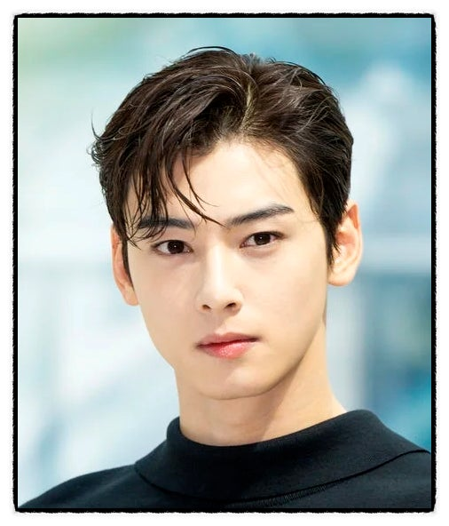
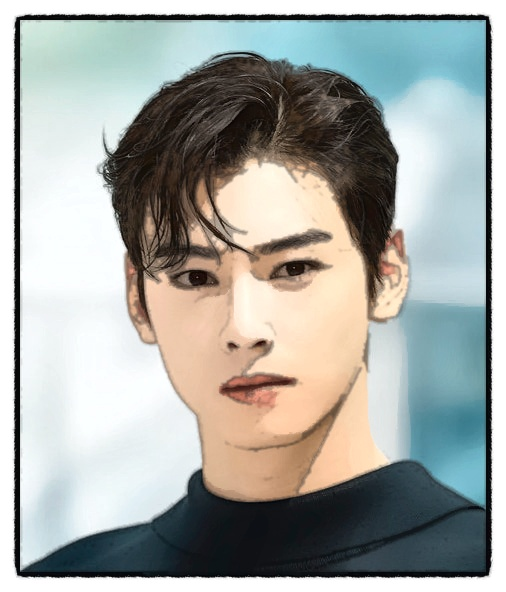
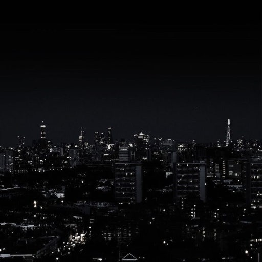
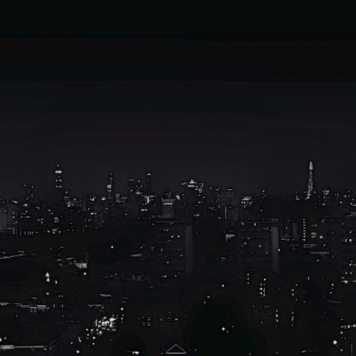

# Toonify Vision

OpenCV 기반 이미지 프로세싱을 이용하여 입력 이미지를 만화(cartoon) 스타일로 변환하는 프로젝트입니다.  
이미지의 윤곽선을 강조하고 색상을 단순화하여 만화와 유사한 효과를 생성하는 것을 목표로 합니다.

---

## 프로젝트 개요

본 프로젝트는 전통적인 컴퓨터 비전 기법을 활용하여 이미지를 카툰 스타일로 변환합니다.  
딥러닝을 사용하지 않고, **엣지 검출 + 색상 단순화**를 통해 만화 느낌을 구현합니다.

---

## 주요 기능

- 이미지 입력 및 출력
- 그레이스케일 변환 및 노이즈 제거
- 에지(윤곽선) 검출
- 색상 단순화 (Bilateral Filter / K-means)
- 윤곽선 + 색상 합성
- 결과 이미지 저장 및 화면 출력

---

## 동작 원리

카툰 렌더링 과정은 다음과 같습니다:

1. 원본 이미지를 불러옵니다.
2. 그레이스케일 변환 후 블러를 적용하여 노이즈를 제거합니다.
3. Canny Edge Detection 또는 Adaptive Threshold로 윤곽선을 추출합니다.
4. Bilateral Filter 또는 K-means로 색상을 단순화합니다.
5. 윤곽선과 색상 이미지를 결합하여 만화 스타일 이미지를 생성합니다.

## 핵심 아이디어  
- **윤곽선 강조 (Edge 강조)**  
- **색상 수 감소 (Color Simplification)**  

---

## 결과 데모

### 잘 되는 경우

배경이 단순하고 인물의 윤곽이 뚜렷한 이미지에서는 만화 스타일이 잘 표현됩니다.

#### 입력 이미지

#### 결과 이미지

---

### 잘 안 되는 경우

야경처럼 어둡고 디테일이 많은 이미지는 결과가 좋지 않습니다.

#### 입력 이미지

#### 결과 이미지

---

## 결과 분석

### 잘 되는 이유

다음과 같은 특징을 가진 이미지에서 좋은 결과가 나옵니다:

- 피사체와 배경이 명확하게 구분됨
- 윤곽선이 뚜렷함
- 배경이 단순함
- 조명이 충분함

이 경우  
- 엣지가 안정적으로 검출됨  
- 색상 단순화가 자연스럽게 적용됨  

---

### 잘 안 되는 이유

다음과 같은 경우 결과가 좋지 않습니다:

- 어두운 이미지 (야경)
- 디테일이 많은 이미지 (도시, 건물)
- 배경이 복잡한 이미지
- 경계가 불분명한 이미지

## 문제점  
- 불필요한 에지 과다 검출  
- 중요한 경계 손실  
- 색상 뭉개짐 발생  

---

## 한계점 (Limitations)

1. **복잡한 배경에 취약**  
   많은 객체가 있는 경우 에지가 과도하게 검출됨

2. **저조도(어두운 이미지)에 약함**  
   충분한 정보가 없어 결과 품질 저하

3. **세밀한 텍스처 표현 어려움**  
   머리카락, 털, 도시 디테일 등이 뭉개짐

4. **파라미터 의존성 높음**  
   필터 크기, 임계값 등에 따라 결과가 크게 달라짐

5. **딥러닝 기반 기법 대비 한계 존재**  
   실제 웹툰/애니메이션 수준의 정교한 표현은 어려움
